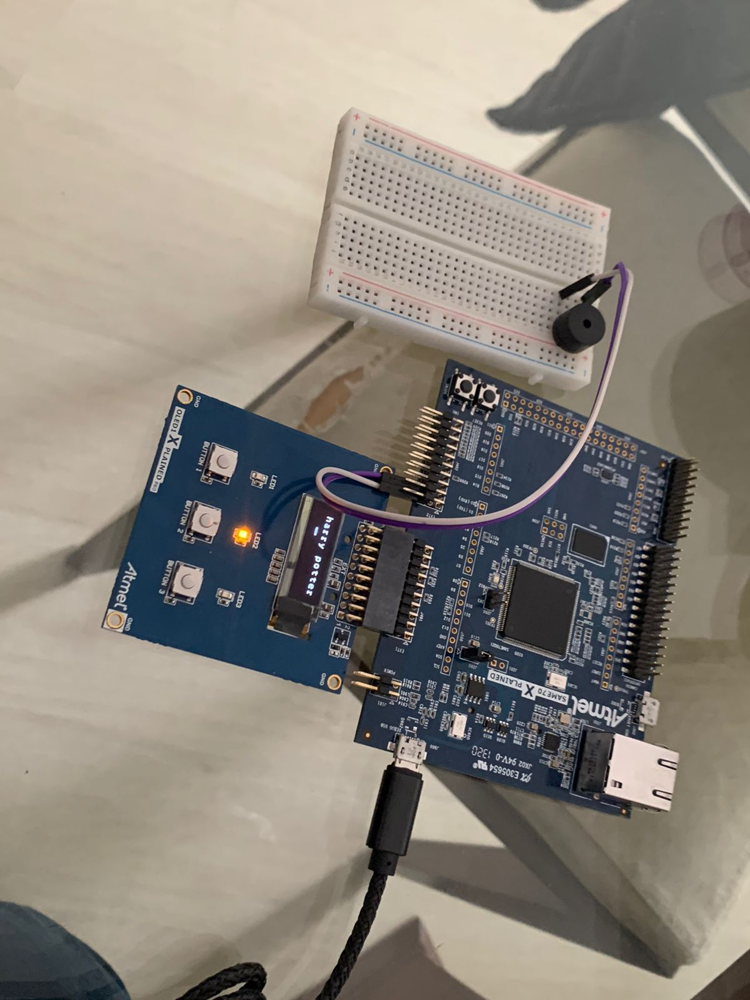

# 21a-emb-aps1

Embarcados - APS 1 - Musical!

Para maiores informações acesse:

https://insper.github.io/ComputacaoEmbarcada/APS-1-Musical/

Issues serão abertos neste repositório para guiar o desenvolvimento
da dupla. **Vocês não devem fechar os issues, apenas a equipe de professores!**, porém devem referenciar nos commits quando um issue 
foi concluído! Isso gerará um PR no classroom que será avaliado pela equipe.

## Documentação

- [auxiliar.h](firmware/src/auxiliar.h): arquivo responsável pelos defines, structs, flags, variáveis globais, prototypes.
- [auxiliar.c](firmware/src/auxiliar.c): arquivo responsável pelos handler/callbacks e funções.
- [main.c](firmware/src/main.c): arquivo para a compilação do código.          

Aqui podemos visualizar qual é a função que cada pino utiliza. Além disso, podemos verificar quais I/O's foram escolhidos.

| Função  | PINO (ex: PA11) |
|---------|-----------------|
| BUZZER  |      PC13       |
| START   |      PA11       |
| SELEÇÃO |      PA19       |
| PAUSE   |      PC31       |
| LED     |      PC30       |

### Imagem da montagem

### Vídeo do projeto

https://youtu.be/gFBrGXOrsDk

### Músicas e Direitos autorais

Todas as músicas utilizadas seguem listadas:
- Harry Potter: https://github.com/robsoncouto/arduino-songs/blob/master/harrypotter/harrypotter.ino
- Star Wars: https://github.com/robsoncouto/arduino-songs/blob/master/cantinaband/cantinaband.ino
- Mario Bros: https://github.com/robsoncouto/arduino-songs/blob/master/supermariobros/supermariobros.ino
